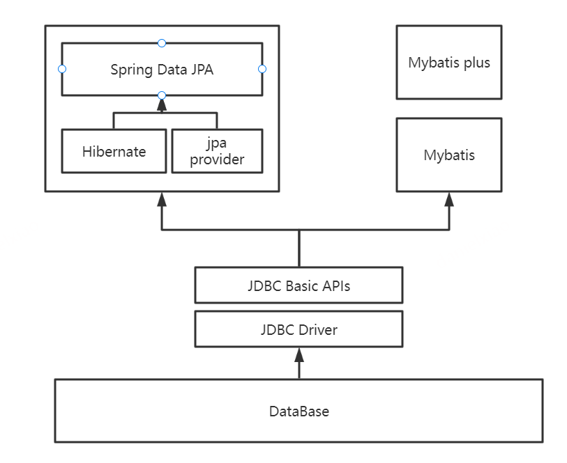

# JDBC，JPA，SpringData JPA，Hibernate，Mybatis区别

## JDBC(java database connectivity)
  是java连接数据库操作的原生接口。JDBC对Java程序员而言是API，对于实现与数据库连接的服务提供商而言是接口模型。
  作为API，JDBC为程序开发提供标准的接口，并为各个数据库厂商及第三方中间件厂商实现与数据库的连接提供了标准方法。

  **一句话概括：jdbc是所有框架操作数据库的必须要用的，由数据库厂商提供，但是为了方便java程序员调用各个数据库，各个数据库厂商都要实现jdbc接口。**
  
## JPA(java persistence api)
（Java Persistence API）是java持久化规范，是orm框架的标准，主流orm框架都实现了这个标准。Sun引入新的JPA ORM规范出于两个原因：其一，简化现有Java EE和Java SE应用开发工作；其二，Sun希望整合ORM技术，实现天下归一。ORM是一种思想，是插入在应用程序与JDBC API之间的一个中间层，JDBC并不能很好地支持面向对象的程序设计，ORM解决了这个问题，通过JDBC将字段高效的与对象进行映射。具体实现有hibernate、spring data jpa、open jpa。

## Spring Data jpa
是 Spring Framework 的一部分。它不是 JPA 的实现，而是在 JPA 之上提供更高层次的抽象，可以减少很多模板代码。而 Spring Data JAP 的默认实现是 Hibernate，当然也可以其他的 JPA Provider。

## hibernate
则是一个 ORM 框架，它实现了 Java 对象到数据库表的映射。也就是说，Hibernate 提供了 JPA 的一种实现。

## mybatis
是一个持久化框架，但不完全是一个orm框架，不是依照的jpa规范。

# 关系

## hibernate和mybatis的区别

（1）hibernate是全自动，而mybatis是半自动

hibernate完全可以通过对象关系模型实现对数据库的操作，拥有完整的JavaBean对象与数据库的映射结构来自动生成sql。而mybatis仅有基本的字段映射，对象数据以及对象实际关系仍然需要通过手写sql来实现和管理。

（2）hibernate数据库移植性远大于mybatis

hibernate通过它强大的映射结构和hql语言，大大降低了对象与数据库（Oracle、MySQL等）的耦合性，而mybatis由于需要手写sql，因此与数据库的耦合性直接取决于程序员写sql的方法，如果sql不具通用性而用了很多某数据库特性的sql语句的话，移植性也会随之降低很多，成本很高。

（3）hibernate拥有完整的日志系统，mybatis则欠缺一些

hibernate日志系统非常健全，涉及广泛，包括：sql记录、关系异常、优化警告、缓存提示、脏数据警告等；而mybatis则除了基本记录功能外，功能薄弱很多。

（4）mybatis相比hibernate需要关心很多细节

hibernate配置要比mybatis复杂的多，学习成本也比mybatis高。但也正因为mybatis使用简单，才导致它要比hibernate关心很多技术细节。mybatis由于不用考虑很多细节，开发模式上与传统jdbc区别很小，因此很容易上手并开发项目，但忽略细节会导致项目前期bug较多，因而开发出相对稳定的软件很慢，而开发出软件却很快。hibernate则正好与之相反。但是如果使用hibernate很熟练的话，实际上开发效率丝毫不差于甚至超越mybatis。

（5）sql直接优化上，mybatis要比hibernate方便很多

由于mybatis的sql都是写在xml里，因此优化sql比hibernate方便很多。而hibernate的sql很多都是自动生成的，无法直接维护sql；虽有hql，但功能还是不及sql强大，见到报表等变态需求时，hql也歇菜，也就是说hql是有局限的；hibernate虽然也支持原生sql，但开发模式上却与orm不同，需要转换思维，因此使用上不是非常方便。总之写sql的灵活度上hibernate不及mybatis。

（6）缓存机制上，hibernate要比mybatis更好一些

MyBatis的二级缓存配置都是在每个具体的表-对象映射中进行详细配置，这样针对不同的表可以自定义不同的缓存机制。并且Mybatis可以在命名空间中共享相同的缓存配置和实例，通过Cache-ref来实现。

而Hibernate对查询对象有着良好的管理机制，用户无需关心SQL。所以在使用二级缓存时如果出现脏数据，系统会报出错误并提示

